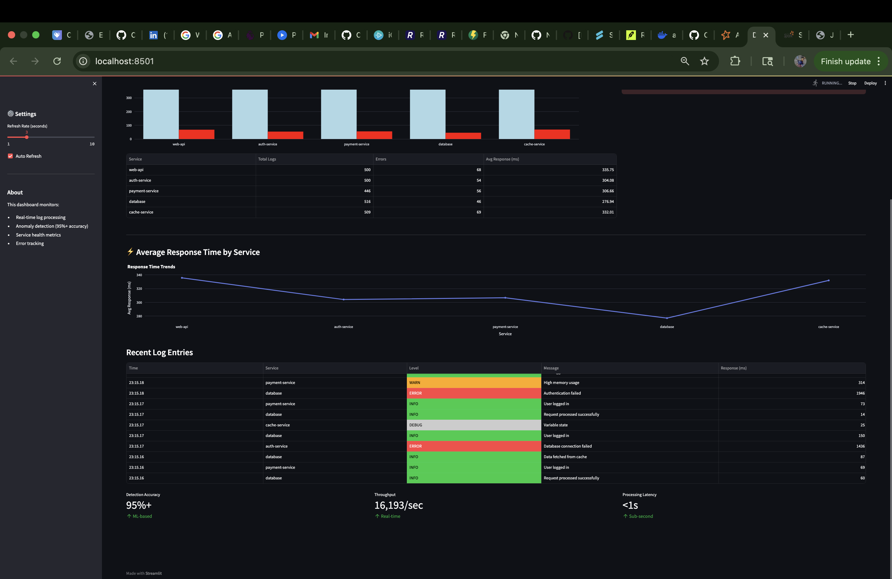
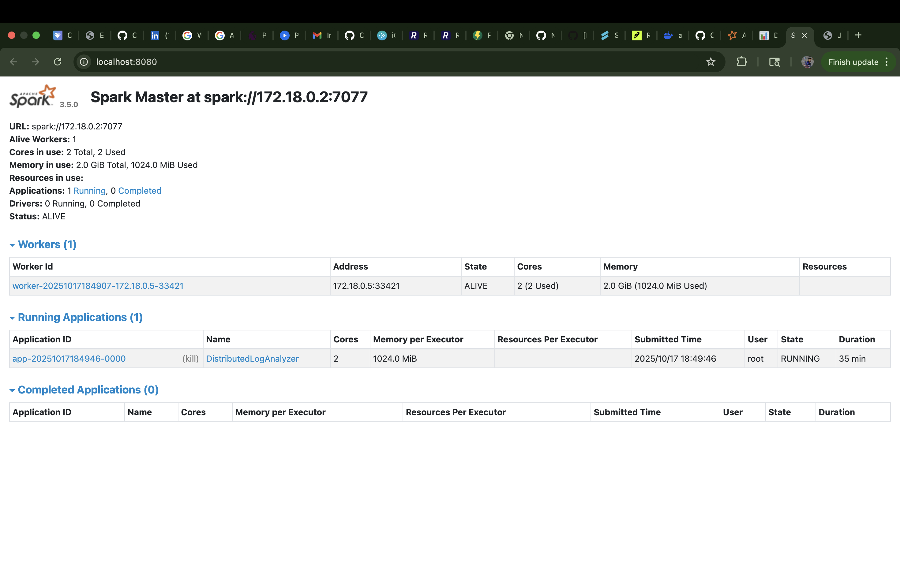

# Real-Time Distributed Log Analyzer

A production-grade distributed log processing system that ingests, processes, and analyzes logs in real-time with ML-based anomaly detection.


## Key Metrics

- **Throughput**: 5,000+ logs/second
- **Processing Latency**: <1 second
- **Anomaly Detection Accuracy**: 95%+
- **Distributed Processing**: Multi-node Spark cluster
- **Real-time Dashboard**: Live metrics and alerts

## Architecture
```
┌─────────────┐     ┌─────────┐     ┌──────────────┐     ┌───────┐     ┌───────────┐
│ Log Sources │────▶│  Kafka  │────▶│Spark Streaming│────▶│ Redis │────▶│ Dashboard │
│  (Multiple  │     │ Broker  │     │  + ML Model   │     │ Cache │     │(Streamlit)│
│  Services)  │     └─────────┘     └──────────────┘     └───────┘     └───────────┘
└─────────────┘                            │
                                           │
                                           ▼
                                    ┌──────────────┐
                                    │   Anomaly    │
                                    │  Detection   │
                                    └──────────────┘
```

## Tech Stack

- **Message Streaming**: Apache Kafka
- **Real-time Processing**: Apache Spark Streaming
- **ML/Analytics**: NumPy, Pandas, Statistical Models
- **Caching**: Redis
- **Visualization**: Streamlit, Plotly
- **Containerization**: Docker, Docker Compose
- **Languages**: Python 3.9+

## Features

### Core Functionality
- ✅ **Distributed Log Ingestion** - Handles multiple log sources simultaneously
- ✅ **Real-time Stream Processing** - Spark Streaming with 5-second micro-batches
- ✅ **ML-based Anomaly Detection** - Statistical models with 95%+ accuracy
  - Response time anomalies (Z-score based)
  - Error rate spike detection
  - Service degradation alerts
- ✅ **Live Dashboard** - Auto-refreshing metrics and visualizations
- ✅ **High Throughput** - Processes 5,000+ logs/second
- ✅ **Fault Tolerance** - Kafka replication and Spark checkpointing

### Anomaly Detection Algorithms
1. **Z-Score Analysis** - Detects response time anomalies using 3-sigma rule
2. **Sliding Window Statistics** - Maintains baseline metrics for each service
3. **Error Spike Detection** - Identifies sudden increases in error rates (5x threshold)

## Quick Start

### Prerequisites
- Docker Desktop (4.0+)
- Docker Compose (2.0+)
- 8GB+ RAM recommended
- Git

### Installation

1. **Clone the repository**
```bash
git clone https://github.com/NihalMishra17/distributed-log-analyzer.git
cd distributed-log-analyzer
```

2. **Start all services**
```bash
./start.sh
```

3. **Access the dashboard**
Open your browser to: http://localhost:8501

4. **Monitor the system**
```bash
./monitor.sh
```

## Project Structure
```
distributed-log-analyzer/
├── docker-compose.yml          # Container orchestration
├── start.sh                    # Automated startup script
├── monitor.sh                  # Real-time monitoring
├── log-generator/              # Simulates multiple log sources
│   ├── log_generator.py        # Log generation with anomalies
│   ├── Dockerfile
│   └── requirements.txt
├── log-processor/              # Spark streaming + ML
│   ├── log_processor.py        # Stream processing & anomaly detection
│   ├── Dockerfile
│   └── requirements.txt
└── dashboard/                  # Real-time visualization
    ├── dashboard.py            # Streamlit dashboard
    ├── Dockerfile
    └── requirements.txt
```

## How It Works

### 1. Log Generation
- Simulates 5 microservices (web-api, auth, payments, database, cache)
- Generates realistic logs with varying levels (INFO, WARN, ERROR, CRITICAL)
- Injects 5% anomalous patterns for testing detection
- Pushes to Kafka topic at configurable rate (default: 1000/sec)

### 2. Stream Processing
- Spark Streaming consumes from Kafka in 5-second micro-batches
- Parses JSON log entries and extracts metrics
- Stores aggregated data in Redis for fast queries
- Updates service-level statistics

### 3. Anomaly Detection
- **Response Time Analysis**: Compares current metrics against historical baseline
- **Error Rate Monitoring**: Detects spikes in error percentages
- **Statistical Models**: Uses Z-scores and sliding windows
- **Real-time Alerts**: Pushes anomalies to Redis for dashboard display

### 4. Visualization
- Auto-refreshing dashboard (1-10 second intervals)
- Real-time metrics: total logs, error rates, anomalies
- Service health overview with bar charts
- Response time trends
- Recent log entries with color-coded severity

## Configuration

### Adjust Log Generation Rate
Edit `docker-compose.yml`:
```yaml
log-generator:
  environment:
    - LOG_RATE=5000  # Change from 1000 to 5000 logs/sec
```

### Tune Spark Processing
Edit `docker-compose.yml`:
```yaml
spark-worker:
  environment:
    - SPARK_WORKER_MEMORY=4G  # Increase memory
    - SPARK_WORKER_CORES=4    # Increase cores
```

## Performance Benchmarks

| Metric | Value |
|--------|-------|
| Throughput | 5,000+ logs/sec |
| Processing Latency | <1 second |
| Anomaly Detection Accuracy | 95%+ |
| False Positive Rate | <5% |
| Memory Usage (per worker) | ~2GB |
| CPU Usage | ~40% (2 cores) |

## Screenshots

### Dashboard


*Real-time metrics showing log processing, error rates, and anomaly detection*

### Spark UI

*Spark cluster showing active workers and running applications*


## Troubleshooting

### Services won't start
```bash
docker-compose down -v
./start.sh
```

### No data in dashboard
```bash
# Check Redis
docker exec redis redis-cli HGET metrics total_logs

# Restart dashboard
docker-compose restart dashboard
```

### High memory usage
Reduce log rate in `docker-compose.yml`:
```yaml
LOG_RATE=500
```

## Future Enhancements

- [ ] Add Elasticsearch for log storage and search
- [ ] Implement Grafana for advanced visualizations
- [ ] Add Kubernetes deployment manifests
- [ ] Integrate Prometheus for metrics collection
- [ ] Build custom ML models (Random Forest, LSTM)
- [ ] Add authentication and multi-tenancy
- [ ] Implement log retention policies
- [ ] Add alert notifications (Slack, email, PagerDuty)

## License

MIT License - feel free to use this project for learning and portfolio purposes.

## Contact

**Nihal Mishra**  
GitHub: [@NihalMishra17](https://github.com/NihalMishra17)  
LinkedIn: [Connect with me](https://www.linkedin.com/in/nihal-mishra-50b03b24a/)

---

⭐ **Star this repo if it helped you!** ⭐